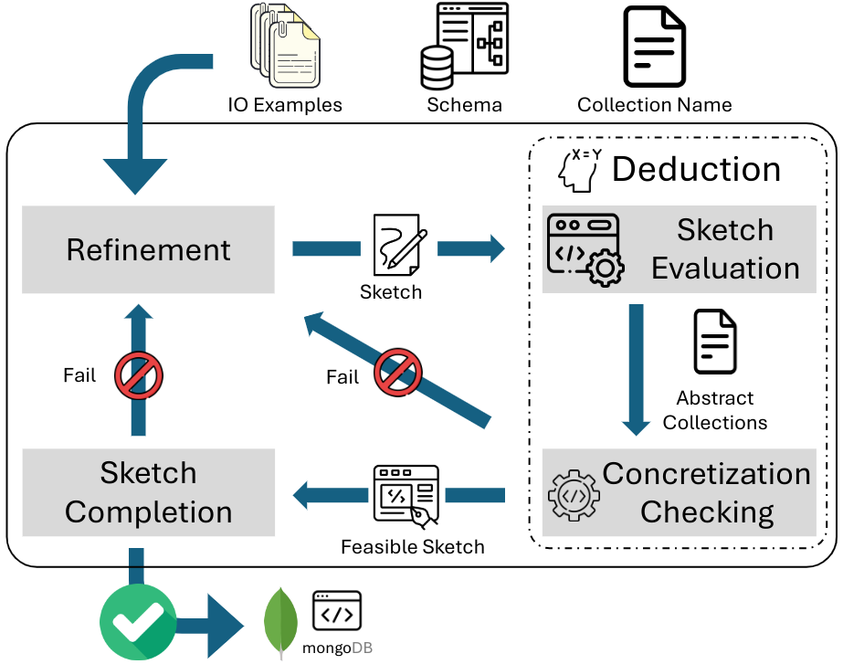
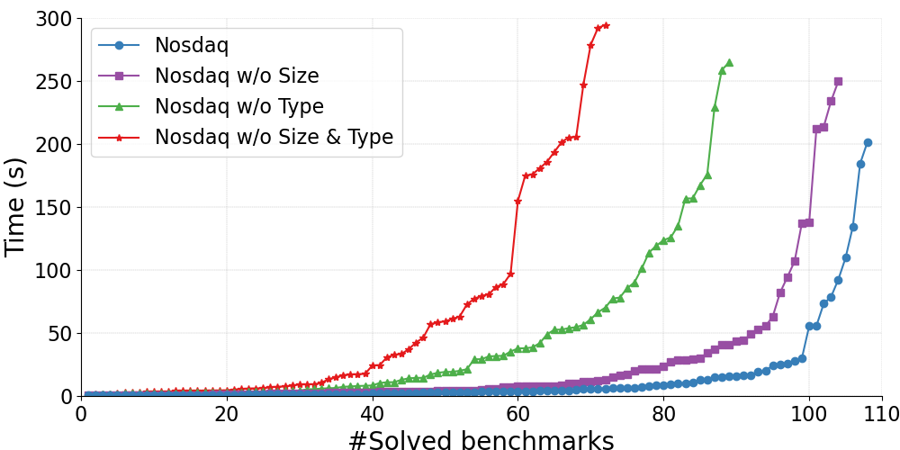
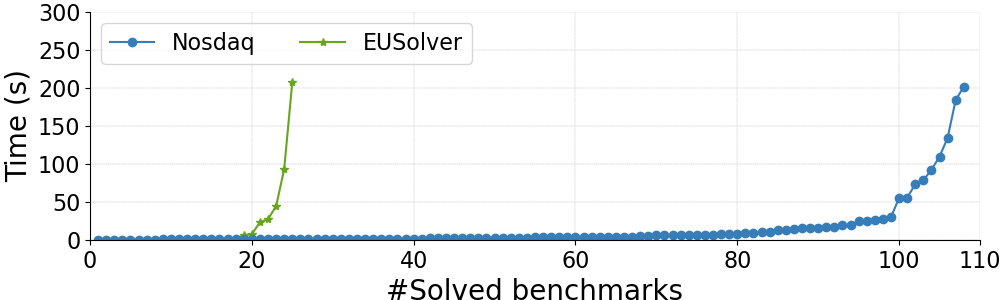
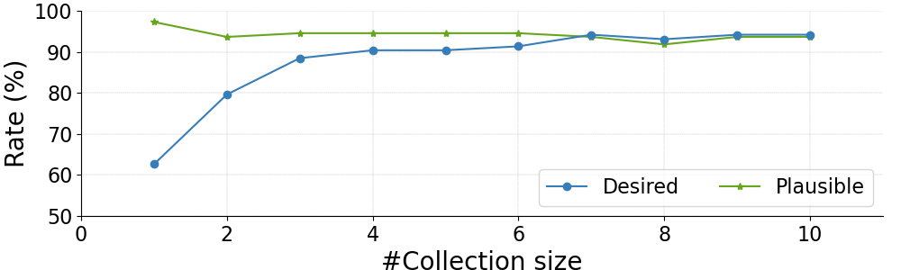

# Synthesizing Document Database Queries using Document Abstractions

----

## 📝 Introduction

**Nosdaq** is a tool to synthesize document database queries (e.g., MongoDB) using abstraction techniques.

<div style="text-align:center"></div>

## 🛠️ Installation

Prerequisites

- Ubuntu or WSL2 (Windows Subsystem for Linux) System
- Docker & Docker-compose


## 🔖 How to use

### 1. Build environment.

```bash
# In the nosdaq/ directory
chmod +x nosdaq.sh && ./nosdaq.sh
```

In our setting, this process took ~5 min. After finishing, you will automatically enter the docker environment.

### 2. Run Nosdaq experiments.

```bash
python3 -m main --mode FULL --timeout 300
python3 -m main --mode NO_LENGTH --timeout 300
python3 -m main --mode NO_TYPE --timeout 300
python3 -m main --mode NO_BOTH --timeout 300
```

The result will be in the `result/` folder and different mode has different folder under `result/`.
In each mode's folder contain three folders and three files:

- `benchstats/`: benchmark statistics for each benchmark.
- `maineval/`: benchmark evaluation for each benchmark
- `programs/`: synthesized program for each benchmark.
- `benchstats.csv`: benchmark statistics.
- `maineval.csv`: benchmark evaluation (if timeout there will only be the benchmark name).
- `programs.txt`: synthesized programs in MongoDB native query format and AST format.

In our setting, those experiments took **~1 hour** in total.

### 3. Experiment for collection size impact on synthesis

```bash
python3 -m main --mode FULL --timeout 300 --experiment SIZE_IMPACT
```
The result will be in the `result_size_impact/` folder. In our setting, this might take **~4 hours**.

### 4. Run Baseline experiments.
Exit the docker environment and run:
```bash
# Firstly, please exit the docker environment by typing `exit` in the shell of docker
cd baselines/eusolver
sudo apt install cmake
pip3 install pyparsing z3-solver
pip3 install -r requirements.txt
./scripts/build.sh
cd src
python3 __main__.py
```

The result will be dumped in the file [baselines/eusolver/result.out](baselines/eusolver/result.out).

In our setting, the EUSolver experiments took **~1 hour**.

### 4. Draw the cactus plot.

Back to the project directory, and follow the instructions to get the plots
in [fig-ablation-study.pdf](fig-ablation-study.pdf) and [fig-baseline.pdf](fig-baseline.pdf).

```bash
pip3 install -r requirements.txt
python3 plot.py
```

## 🐎 Experiments

### Benchmarks

| Benchmarks        | Benchmark Count |
|-------------------|-----------------|
| StackOverflow     | 33              |
| Official Document | 26              |
| Twitter API   | 5               |
| Kaggle            | 46              |

See the `Banchmarks` and `BenchStats` sheets in [Mongo_Synth_Benchmarks.xlsx](Mongo_Synth_Benchmarks.xlsx) 
for details of benchmarks.

### Experimental results

**Timeout = 5 min**

| Method                | #Solved benchmarks |
|-----------------------|--------------------|
| EUSolver              | 25                 |
| Nosdaq w/o Len & Type | 72                 |
| Nosdaq w/o Type       | 89                 |
| Nosdaq w/o Len        | 104                |
| **Nosdaq**            | 108                |

*Note that Nosdaq takes the least time cost comparing against the others.*

### Ablation study

<div style="text-align:center"></div>

### Baseline
<div style="text-align:center"></div>

### (OPTIONAL) Collection size impact
<div style="text-align:center"></div>
<div style="text-align:center"></div>

### Experimental setting

The experiments are run in parallel on a laptop running Ubuntu 22.04 WSL2 with an Intel i9-13905H CPU and 32GB of RAM.

*It may be possible to obtain better results if you run them in a single processor or on a more powerful platform, but the conclusions will remain the same.*
